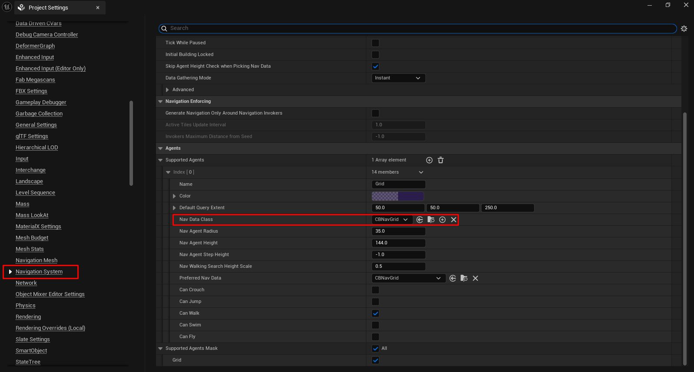
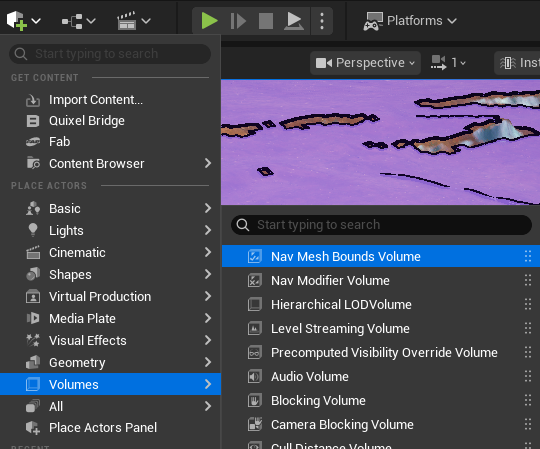
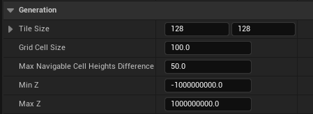
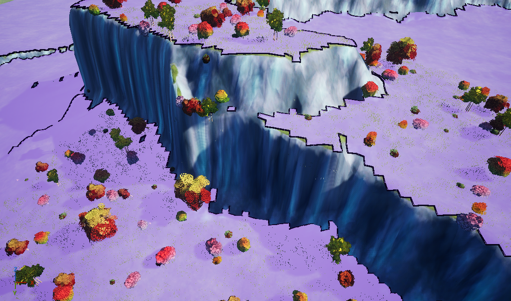
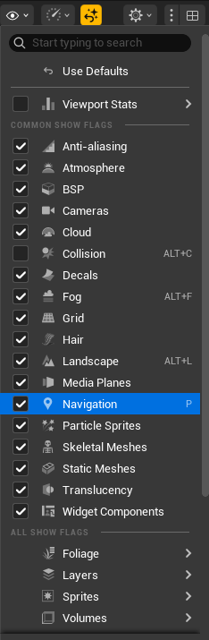
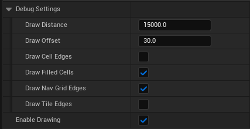

# CBNavGrid Plugin (Unreal Engine 5)

Provides a custom navigation data for UE5, designed primarily for grid-based city-building games.
Originally was made to provide grid-aligned pathfinding for road/wall placement, fallback navigation for units and a way to check if a cell is suitable for building placement.
**Still in development.**

## Features

### Integration with UE's built-in navigation system

Uses the same API as UE's NavMesh and stores exported collision data cache in NavigationOctree using Recast coordinate system to be compatible with NavMesh in the same world.

### Lightweight

Stores only traversability bit flag, height float and a couple of floats and a pointer needed for navigation data generation for each cell of grid.

### Background generation

Per tile generation on background threads.

### Axis-wise heuristic scale

Originally provided to be able to find path for road placement following specific axis first.
Can be configured through `AxiswiseHeuristicScale` member of `FCBNavGridQueryFilter`.

### String pulling of paths

By default `CBNavGrid` string pulls found paths, to get not string pulled path you'll need to provide to query `FCBNavGridPath` instance with set to false `bWantsStringPulling` flag.

### Debug visualization

Provides configurable debug visualization for editor and development builds.

## Limitations

Limitations are dictated by the needs of project this navigation data is made for.

### One-layered

Navigation data is generated only for the highest collision in each point in navigation bounds. Also, bounds are treated as 2d rectangles, z axis in bounds absolutely irrelevant for this navigation data.

### No support for:

* Streaming
* Navigation invokers
* Navigation links
* NavAreas except for Null and Default
* NavAgent radius and height

## Installation

1. Clone `CBNavGrid` plugin into your project's `Plugins` directory.
1. Enable `CBNavGrid` in the Plugins window.
1. Add NavAgent with `CBNavGrid` as Nav Data Class in Navigation System tab of Project Settings.
1. Place `NavMeshBoundsVolume` in world.

## Configuration

Once `CBNavGrid` actor added to world it can be configured using Details panel.

Every time navigation data updates it generates whole tile in which changes took place, hence tile size parameter could be used to configure how many cells will be regenerated at once.

Max Navigable Cell Heights Difference is used to decide if cell is traversable or not.
It is compared with difference in Z of the highest collision geometry in cell.

Min and Max Z used to configure in which range collision will be gathered to produce navigation data.

## Debug visualization

To show debug visualization you need to toggle Navigation show flag as shown below and ensure that Enable Drawing flag in `CBNavGrid` actor is set to true.

Debug visualization updates every 1 sec.
That is needed to avoid stalls during frequent collision updates in editor.

## Possible future improvements

* Some sort of links support may be provided later to handle seamless bridge creation during road placement.
* Currently uses UE's A* for pathfinding. JPS may be implemented in the future, though unlikely.
